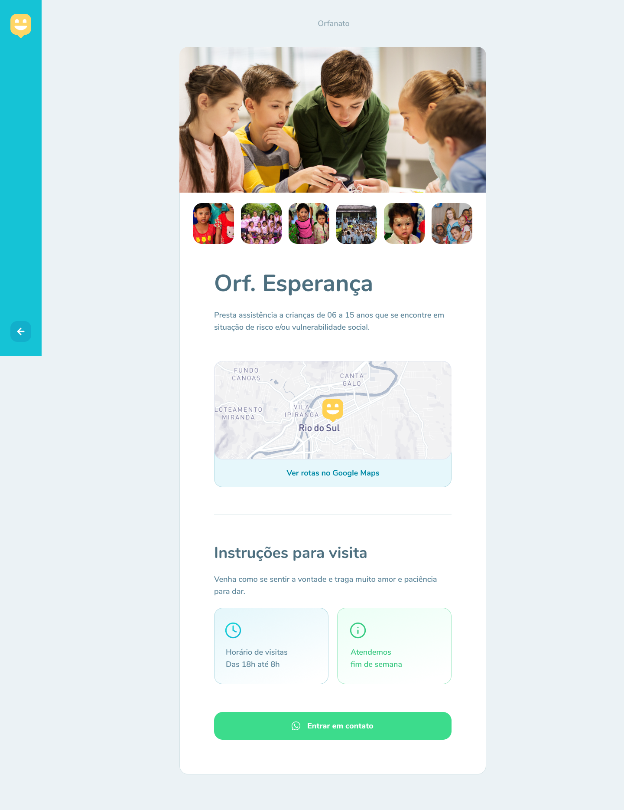

<!-- PROJECT LOGO -->
<br />
<p align="center">
  <a href="https://github.com/AdamAugustinsky/happy-web">
    
  </a>

  <h3 align="center">Happy Web</h3>

  <p align="center">
    Happy is a platform to help make orphan children happier
  </p>
</p>

<p align="center">
  
</p>

<p align="center">
  
</p>

<p align="center">
  
</p>

<!-- TABLE OF CONTENTS -->
## Table of Contents

* [Built With](#built-with)
* [Getting Started](#getting-started)
  * [Prerequisites](#prerequisites)
  * [Installation](#installation)
* [Contributing](#contributing)
* [License](#license)
* [Contact](#contact)

### Built With

* [TypeScript](https://www.typescriptlang.org)
* [React](https://reactjs.org/)


<!-- GETTING STARTED -->
# Getting Started

To get a local copy up and running follow these simple steps.

### Prerequisites

Install the following:
* [Node.js](https://nodejs.org/en/)
* [Yarn](https://yarnpkg.com/getting-started/install) (Optional)

### Installation

1. Clone the repo
```sh
git clone https://github.com/AdamAugustinsky/happy-web
```
2. Enter the project file
```sh
cd happy-web
```
3. Install NPM packages
```sh
yarn
```
### or
```sh
npm install
```

<!-- CONTRIBUTING -->
## Contributing

Contributions are what make the open source community such an amazing place to be learn, inspire, and create. Any contributions you make are **greatly appreciated**.

1. Fork the Project
2. Create your Feature Branch (`git checkout -b feature/AmazingFeature`)
3. Commit your Changes (`git commit -m 'Add some AmazingFeature'`)
4. Push to the Branch (`git push origin feature/AmazingFeature`)
5. Open a Pull Request


<!-- LICENSE -->
## License

Distributed under the MIT License. See `LICENSE` for more information.


<!-- CONTACT -->
## Contact

Adam Axel Augustinsky - AdamAugustinsky@gmail.com

Project Link: [https://github.com/AdamAugustinsky/happy-web](https://github.com/AdamAugustinsky/happy-web)
